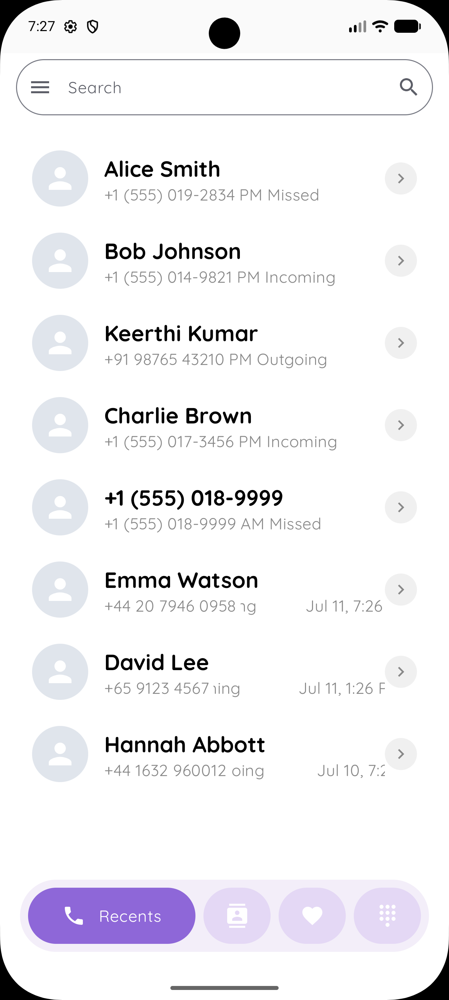
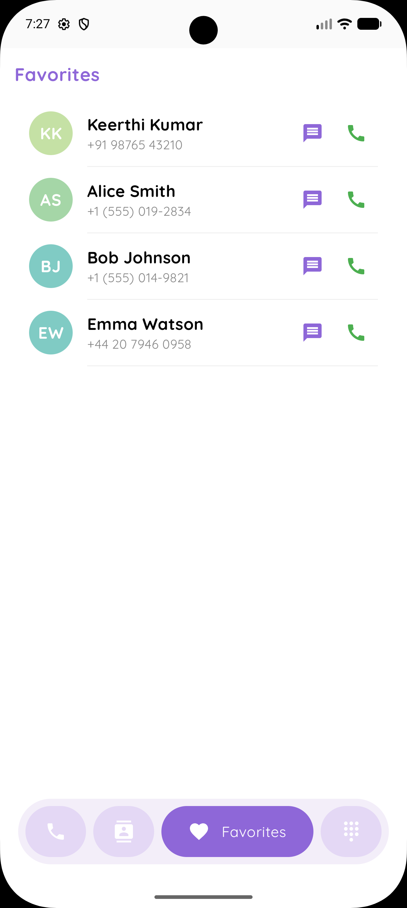
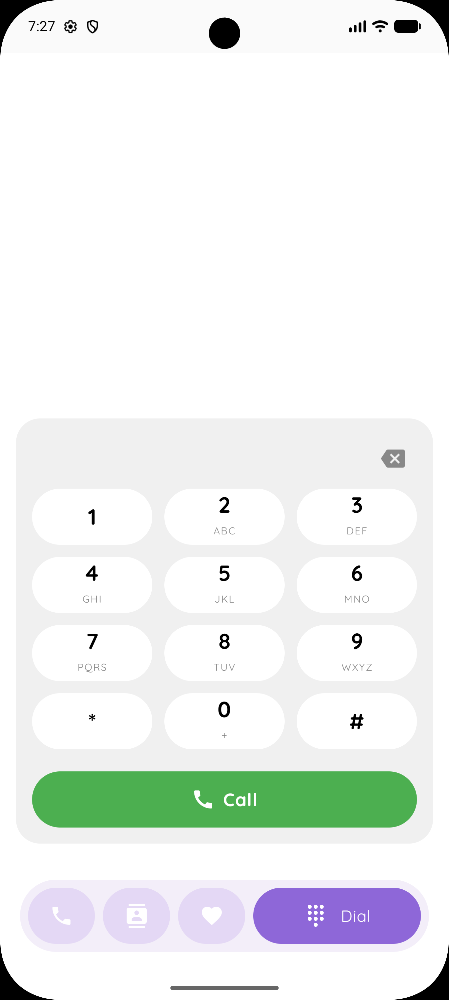
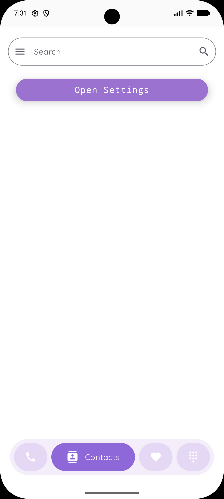
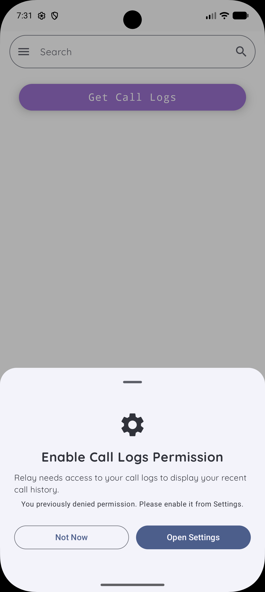
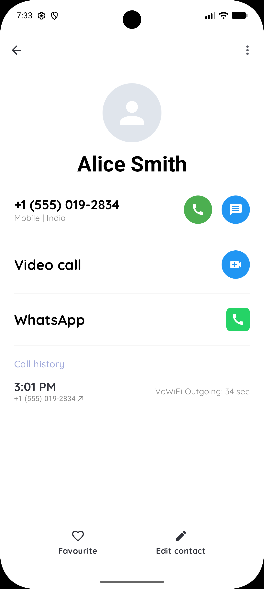

# 📞 Relay

**A modern Contacts app built with Jetpack Compose**

Simple • Fast • Beautiful

</div>

---

## ✨ Overview

Relay is a modern Android Contacts application built entirely with **Jetpack Compose**. It provides a clean and intuitive interface for browsing, searching, and managing your device contacts while following Material Design principles.

The goal of Relay is to demonstrate modern Android development practices using Kotlin and Jetpack Compose with a responsive and user-friendly UI.

---

## 📱 Features

- 📋 View all device contacts
- 🔍 Real-time contact search
- 📞 One-tap phone calls
- 👤 Beautiful contact cards
- ⚡ Smooth scrolling experience
- 🎨 Material Design 3 UI
- 📱 Responsive layout
- 🔒 Runtime contact permission handling
- 🧩 Built completely with Jetpack Compose

---
## 📸 Screen shots

<table>
<tr>
<td align="center">
<br/>
<b>Permission Request</b>
</td>

<td align="center">
<br/>
<b>Contacts List</b>
</td>

<td align="center">
<br/>
<b>Search Contacts</b>
</td>
</tr>

<tr>
<td align="center">
<br/>
<b>Contact Details</b>
</td>

<td align="center">
<br/>
<b>Permission Dialog</b>
</td>

<td align="center">
<br/>
<b>Calling Interface</b>
</td>
</tr>
</table>

---

## 🛠 Tech Stack

- **Language:** Kotlin
- **UI Toolkit:** Jetpack Compose
- **Architecture:** MVVM
- **Material Design 3**
- **Android Contacts Provider**
- **State Management:** Compose State
- **Minimum SDK:** 24

---

## 📂 Project Structure

```
app
├── data
│   └── contacts
├── ui
│   ├── components
│   ├── screens
│   └── theme
├── utils
└── MainActivity.kt
```

---

## 🚀 Getting Started

### Clone the repository

```bash
git clone https://github.com/yourusername/Relay.git
```

### Open in Android Studio

1. Open Android Studio
2. Select **Open**
3. Choose the project folder
4. Sync Gradle
5. Run the application

---

## 🔑 Permissions

Relay requires the following permission:

```xml
<uses-permission android:name="android.permission.READ_CONTACTS"/>
```

The app requests this permission at runtime before accessing your contacts.

---

## 🎯 Learning Objectives

This project demonstrates:

- Jetpack Compose UI
- State Management
- Runtime Permissions
- Contacts Provider API
- LazyColumn
- Search Functionality
- Material Design 3
- Modern Android Development

---

## 📈 Future Improvements

- 🌙 Dark Mode Enhancements
- 📝 Edit Contacts
- ➕ Add Contacts
- 🗑 Delete Contacts
- 📷 Contact Photos
- 📤 Share Contact
- ☁ Backup & Restore

---

## 👨‍💻 Author

**Keerthi vasan**

- GitHub: https://github.com/Keerthivasan-7

---

## 📄 License

This project is licensed under the MIT License.

---

<div align="center">

Made with ❤️ using Jetpack Compose

</div>
